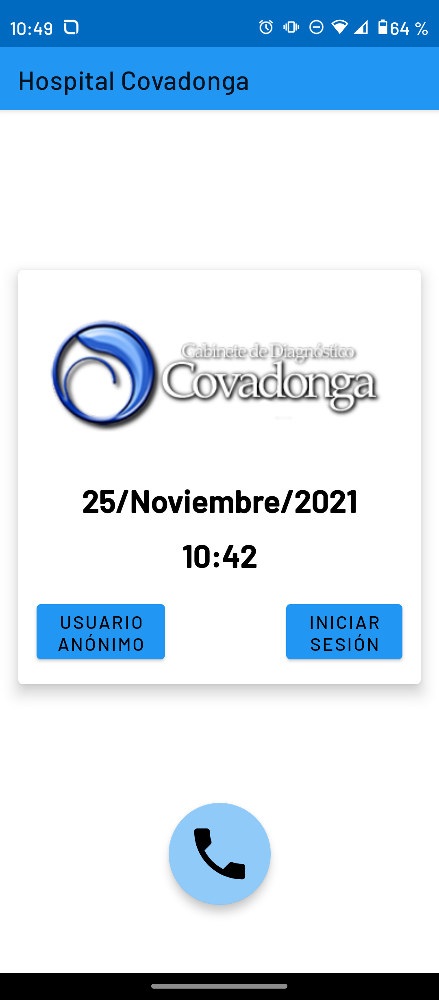
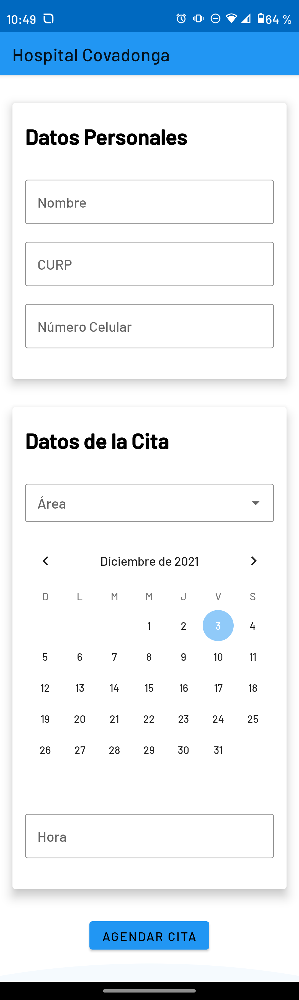
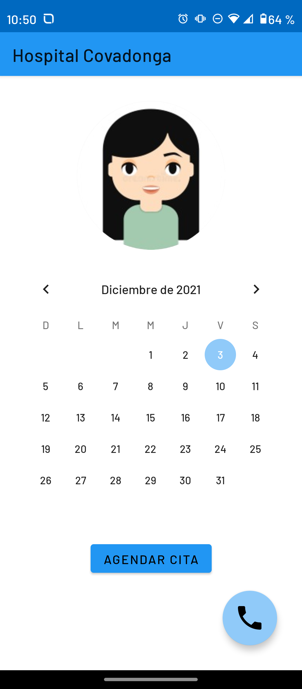
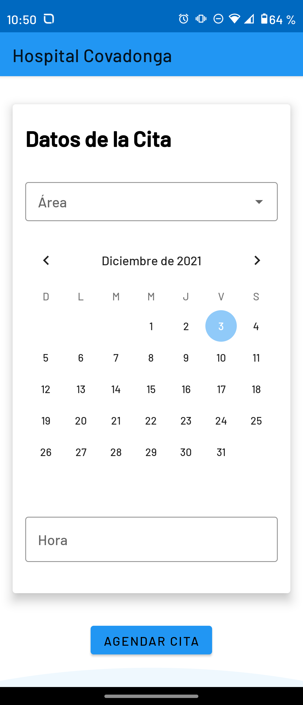
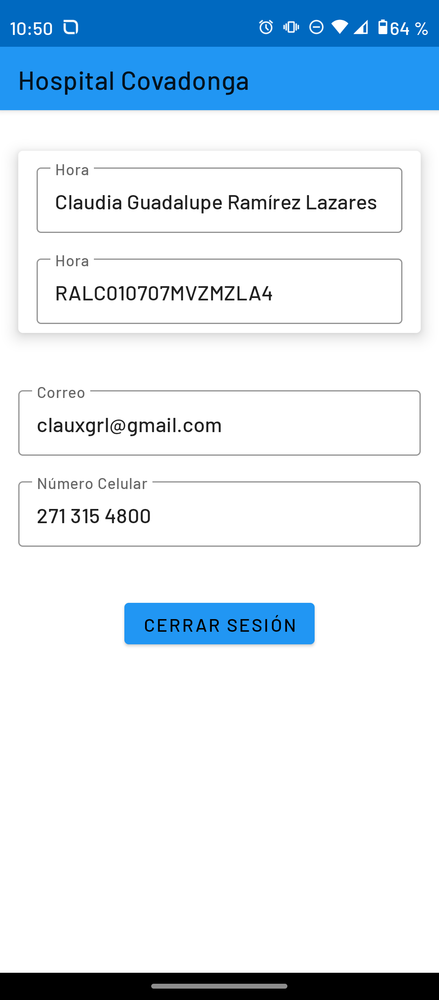
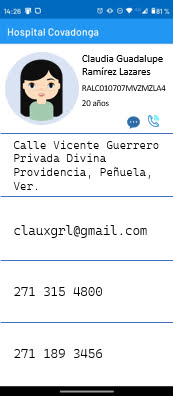
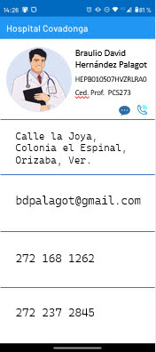
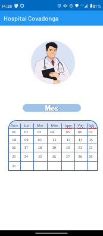

# Hospital_Covadonga
Proyecto del Track Covadonga para el Hackathon Orizaba 2021

---

  Aplicación móvil creada en lenguaje Kotlin

## Descripción general
Aplicación diseñada con la finalidad de agilizar procesos de atención a pacientes en el sector salud privado, innovando en la atención de situaciones de urgencia y citas calendarizadas mediante la implementación de tecnologías móviles.

La interfaz gráfica de usuario se diseñó teniendo como prioridad la intuitividad para reducir la curva de aprendizaje de los pacientes que la utilizarán. De igual forma se estableció el sistema operativo Android 8.0 Oreo (API 26) cómo versión mínima para abarcar un 82.7% de usuarios de Android según los últimos datos reportados en la web de Android Developers.

### Flujo de acción de la aplicación
La primera pantalla nos mostrará las opciones de iniciar sesió para revisar nuestro expediente de citas o de agendar una cita espontánea sin registrarse en la aplicación. Además nos muestra un botón de llamada de emergencia en caso de que se sucite una situación de emergencia y se requiera contactar rápidamente al hospital. 

  

En caso de generar una cita espontánea, se deberán registrar todos los datos necesarios del paciente y seleccionar el área de atención, la fecha y la hora. 

  

En caso de iniciar sesión, pasaremos a un flujo independiente en donde podremos visualizar la calendarización de citas que se tiene, acceder a la generaciónd enuna cita, además de poder acceder a nuestro perfil de paciente y, una vez más, a la llamada de emergencia. 

  

Si se accede a la agendación de cita con un perfil de paciente iniciado, únicamente nos solicitará el área de atención, la fecha y la hora; esto debido a que los demás datos ya se encuentran almacenados en el propio perfil. 

  

Si se accede al perfil podremos ver un resumen de la información almacenada del paciente, así como cerrar la sesión qu hemos iniciado. 

  

## Propuesta de valor 💻
<li>
  <ul>Atención personalizada.</ul>
  <ul>Autogestión de la salud del paciente.</ul>
  <ul>Seguimiento por parte del paciente.</ul>
</li>

---
## Mockup para futuras actualizaciones

Perfil más avanzado del paciente. 

  

Acceso al perfil de tu doctor de cabecera. 

  

Versión propia del doctor para gestionar las citas que tiene programadas con sus pacientes. 

  

Estos cambios se planean implementar en un futuro para que cada doctor pueda observar los perfiles detallados de los pacientes que tengan agendada una cita con él, eliminando la necesidad de realizar preguntas repetitivas en cada consulta, pues el expediente clínico estaría almacenado en el perfil del paciente. De igual forma, cada paciente podrá acceder al perfil de su doctor de cabecera en caso de que desee realizarle una consulta de forma virtual por mensajería o llamada telefónica.
